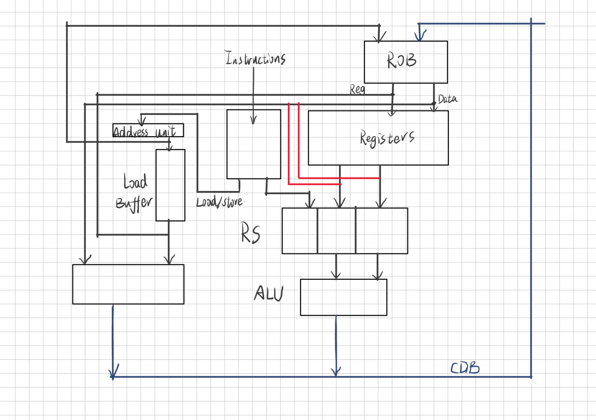

# RICK-V
The homework for course CS2951,SJTU

# File Structure

## Top Level Module:

`cpu.v`: The main module that integrates all components of the CPU.

## Modules

`fetch.v`: Module for fetching instructions from memory.

`decode.v`: Module for decoding the fetched instructions and sending them to the appropriate execution units.

`regfile.v`: Contains the register file logic, including read and write ports.

`rob.v`: Implements the reorder buffer for maintaining the order of instruction completion.

`reservation_station.v`: Implements the reservation stations for different functional units (ALU etc.).

`alu.v`: ALU module for arithmetic and logic operations.

`data_memory.v`: Module for handling data memory accesses (load/store).

`control.v`: Generates control signals for the CPU based on the decoded instruction.

## Test

`tb_cpu.v`: A testbench to simulate and verify CPU design.