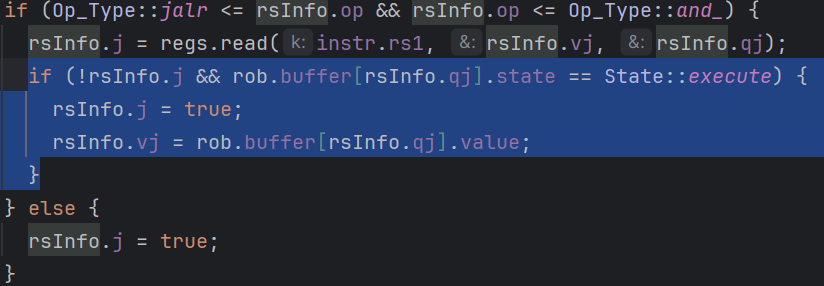

```verilog
case(opcode) 
          CodeLui: begin // LUI
            op_type <= 0;
            imm <= imm_u;
            pc_next <= pc + 4;
          end
          CodeAupic: begin // AUIPC
            op_type <= 1;
            imm <= imm_u + pc;
            pc_next <= pc + 4;
          end
          CodeJal: begin // JAL
            op_type <= 2;
            imm <= pc + 4;
            pc_next <= pc + imm_j;
          end
          CodeJalr: begin // JALR
            op_type <= 3;
            imm <= pc + 4;
            inst_pc <= ({25'b0, func7} << 5) + {27'b0, rs2_raw};
            if (func7[6]) begin
              inst_pc <= inst_pc | 32'hfffff000;
            end
            stall <= 1;
          end
          CodeBr: begin // BEQ, BNE, BLT, BGE, BLTU, BGEU
            imm <= pc + 4;
            pc_next = pc + imm_b; // todo: predictor
            case (func3)
              3'b000: begin // BEQ
                op_type <= 4;
              end
              3'b001: begin // BNE
                op_type <= 5;
              end
              3'b100: begin // BLT
                op_type <= 6;
              end
              3'b101: begin // BGE
                op_type <= 7;
              end
              3'b110: begin // BLTU
                op_type <= 8;
              end
              3'b111: begin // BGEU
                op_type <= 9;
              end
              default: begin
                // invalid instruction 
              end
            endcase
          end
          CodeLoad: begin // LB, LH, LW, LBU, LHU
            pc_next <= pc + 4;
            imm <= imm_i;
            case (func3)
              3'b000: begin // LB
                op_type <= 10;
              end
              3'b001: begin // LH
                op_type <= 11;
              end
              3'b010: begin // LW
                op_type <= 12;
              end
              3'b100: begin // LBU
                op_type <= 13;
              end
              3'b101: begin // LHU
                op_type <= 14;
              end
              default: begin
                // invalid instruction
              end
            endcase
          end
          CodeStore: begin // SB, SH, SW
            imm <= imm_s;
            pc_next <= pc + 4;
            case (func3)
              3'b000: begin // SB
                op_type <= 15;
              end
              3'b001: begin // SH
                op_type <= 16;
              end
              3'b010: begin // SW
                op_type <= 17;
              end
              default: begin
                // invalid instruction
              end
            endcase
          end
          CodeArithI: begin // ADDI, SLTI, SLTIU, XORI, ORI, ANDI, SLLI, SRLI, SRAI
            imm <= imm_i;
            pc_next <= pc + 4;
            case (func3)
              3'b000: begin // ADDI
                op_type <= 18;
              end
              3'b010: begin // SLTI
                op_type <= 19;
              end
              3'b011: begin // SLTIU
                op_type <= 20;
              end
              3'b100: begin // XORI
                op_type <= 21;
              end
              3'b110: begin // ORI
                op_type <= 22;
              end
              3'b111: begin // ANDI
                op_type <= 23;
              end
              3'b001: begin // SLLI
                op_type <= 24;
                imm <= {27'b0, rs2_raw}; // shamt
              end
              3'b101: begin // SRLI, SRAI
                if (func7[5]) begin // SRAI
                  op_type <= 26;
                end else begin // SRLI
                  op_type <= 25;
                end
                imm <= {27'b0, rs2_raw}; // shamt
              end
              default: begin
                // invalid instruction
              end
            endcase
            if (inst === 32'h0ff00513) begin // exit
              op_type <= 38;
            end
          end
          CodeArithR: begin // ADD, SUB, SLL, SLT, SLTU, XOR, SRL, SRA, OR, AND
            pc_next <= pc + 4;
            case (func3)
              3'b000: begin // ADD, SUB
                if (func7[5]) begin // SUB
                  op_type <= 29;
                end else begin // ADD
                  op_type <= 28;
                end
              end
              3'b001: begin // SLL
                op_type <= 30;
              end
              3'b010: begin // SLT
                op_type <= 31;
              end
              3'b011: begin // SLTU
                op_type <= 32;
              end
              3'b100: begin // XOR
                op_type <= 33;
              end
              3'b101: begin // SRL, SRA
                if (func7[5]) begin // SRA
                  op_type <= 35;
                end else begin // SRL
                  op_type <= 34;
                end
              end
              3'b110: begin // OR
                op_type <= 36;
              end
              3'b111: begin // AND
                op_type <= 37;
              end
              default: begin
                // invalid instruction
              end
            endcase
          end
          default: begin
            pc_next <= pc + 4;
            op_type <= 39;
            // invalid instruction
          end
        endcase
```

