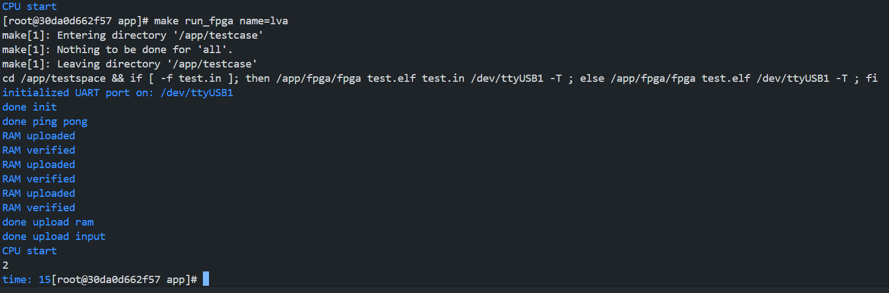
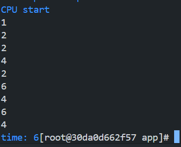

# 上板情况说明

**周期**: 10ns

## 在评测时可能出现奇怪的情况

实在不好意思, 不确定是我使用的板子的原因还是代码的遗留问题 (遗留问题: 我对于HALT沿用了暑假时C++版本所要求的对`inst == 32'h0ff00513`的特判 这可能导致正常停机时 一些部分没有被执行 但由于牵扯的逻辑过多 可能要正确的纠正需要重构整个代码) 使得在我的本地测试中出现了如下问题:

- 在正常运行完一个测试点后 按理说能够直接运行下一个测试点 但在我这里会遇到异常情况: 下一次的程序将无法正常运行 (可能立刻结束 没有任何输出) 即使是在运行完成后按reset也无法纠正这一问题 下一次运行依旧异常

- 当然 我怀疑过是reset的问题 但是在第一次正常第二次异常结束或终止的情况下 再按reset 则第三次能够正常的运行

**非常抱歉没能解决这个问题, 如果测试过程中这个问题依旧出现，还烦请学长学姐帮忙手动测试一下QAQ**

即对于每一个测试点: 测试 结束后进行第二次 按下reset 运行下一个测试点

---

以下是我本地的通过情况

## 通过情况

### failed

`basicopt1`: failed in ic & i

`bulgarian`: failed in ic (but passed in i)

`magic`: failed in ic (but passed in i)

`testsleep`: 
  - passed in i (which give 700000045 10)
  - failed in ic (which give 699990045 9)

### passed locally

`array_test1`: passed

`array_test2`: passed

`expr`: passed

`gcd`: passed

`hanoi`: passed

`heart`: took about 30 min to finish

`looper`: maybe passed?

`lvalue2`: passed

`manyarguments`: passed

`multiarray`: passed

`pi`: passed

`qsort`: passed

`queens`: passed

`statement_test`: passed

`superloop`: passed

`tak`: passed

`uartboom`: passed

